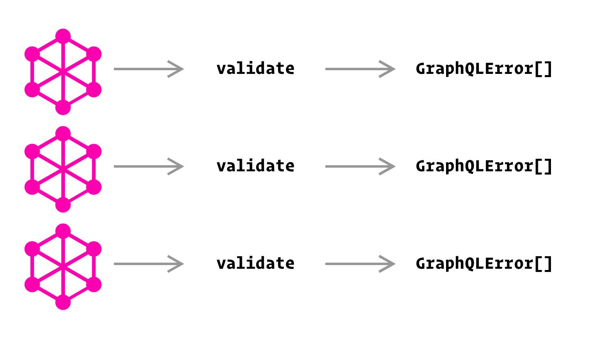

import { Head, Image } from 'mdx-deck';
import { Split, Invert } from 'mdx-deck/layouts';
export { default as theme } from './theme.js';
import { Appear } from 'mdx-deck';

<Head>
  <title>Federated Validation</title>
</Head>

export default Invert;

# Federated Validation

---

## What I'm Talking About

- What is validation
- Validation of a single service
- Validation of federated services
- What validation errors look like

---

export default Invert;

# What is validation?

---

export default Invert;

# Single Service

---



---

export default Invert;

# Federated Services

---


---

## Why does it look like this?

- It's hard to know what the original schemas looked like.
- Types are merged with extensions
- Certain fields are stripped (like `@external` fields)

---


---

```js
export function composeAndValidate(serviceList: ServiceDefinition[]) {
  const errors = validateServicesBeforeNormalization(serviceList);

  const normalizedServiceList = serviceList.map(({ name, typeDefs }) => ({
    name,
    typeDefs: normalizeTypeDefs(typeDefs),
  }));
  errors.push(...validateServicesBeforeComposition(normalizedServiceList));

  const compositionResult = composeServices(normalizedServiceList);
  errors.push(...compositionResult.errors);

  errors.push(...validateComposedSchema(compositionResult.schema));

  return { schema: compositionResult.schema, warnings: [], errors };
}
```

---

<pre>
  <h2>validateServicesBeforeNormalization</h2>
</pre>

- Normalization makes sure the root operation types (Query and Mutation) are named `Query` and `Mutation`, as well as handing the `@extends` directive.
- This function validates things that would cause errors in normalization

---

export default Invert;

## Rules (so lonely)

- `rootFieldUsed`

  - If the base types are renamed, make sure `Query`

    and `Mutation` aren't used.

    <!-- the additional whitespace is needed here -->

---

<pre>
  <h2>validateServicesBeforeComposition</h2>
</pre>

- Validates each schema separately
- Composition modifies the schemas and strips out things like `@external` fields, so we need to validate the things that get stripped

---

export default Invert;

## Rules

- `externalUsedOnBase`
  - `@external` directive can not be used on base types
- `requiresUsedOnBase`
  - `@requires` directive can not be used on base types
- `keyFieldsMissingExternal`
  - `@key` selects field not marked as `@external`
- +3 more

---

<pre>
  <h2>validateSDL</h2>
</pre>

- Validated _during_ composition.
- Uses list of all type definitions/extensions
- Uses some `graphql-js` validations
  - omits rules that would conflict with federation spec like `UniqueTypeNames`
- Additional validations related to cross-service type definitions

---

export default Invert;

## Rules

- `UniqueTypeNamesWithoutEnumsOrScalars`
  - Modified version of `UniqueTypeNames`
- `MatchingEnums`
  - Enums must be identical in each service
- `PossibleTypeExtensions`
  - Type extensions must extend existing types

---

<pre>
  <h2>validateComposedSchema</h2>
</pre>

- Preferred place to validate if possible
- Validates the result of schema composition
- Uses some validation rules from graphql-js

---

export default Invert;

## Rules

- `externalUnused`
  - external field isn't used
- `externalMissingOnBase`
  - external used on a field not on the base type
- `externalTypeMismatch`
  - external field doesn't match the field on the base type
- +6 more

---

# Anatomy of an error

---

```js
// Service A
type Product @key(fields: "sku") {
  sku: String!
  upc: String!
}
```

```js
// Service B
extend type Product @key(fields: "sku") {
  sku: String @external
  price: Int! @requires(fields: "sku")
}
```

---

export default Invert;

```
GraphQLError {
  message: `
    [serviceB] Product.sku ->
    Type `String` does not match the type of
    the original field in serviceA (`String!`)
  `,
  extensions: {
    code: 'EXTERNAL_TYPE_MISMATCH'
  }
}
```

---

export default Invert;


---

export default Invert;

<h1>😀</h1>
